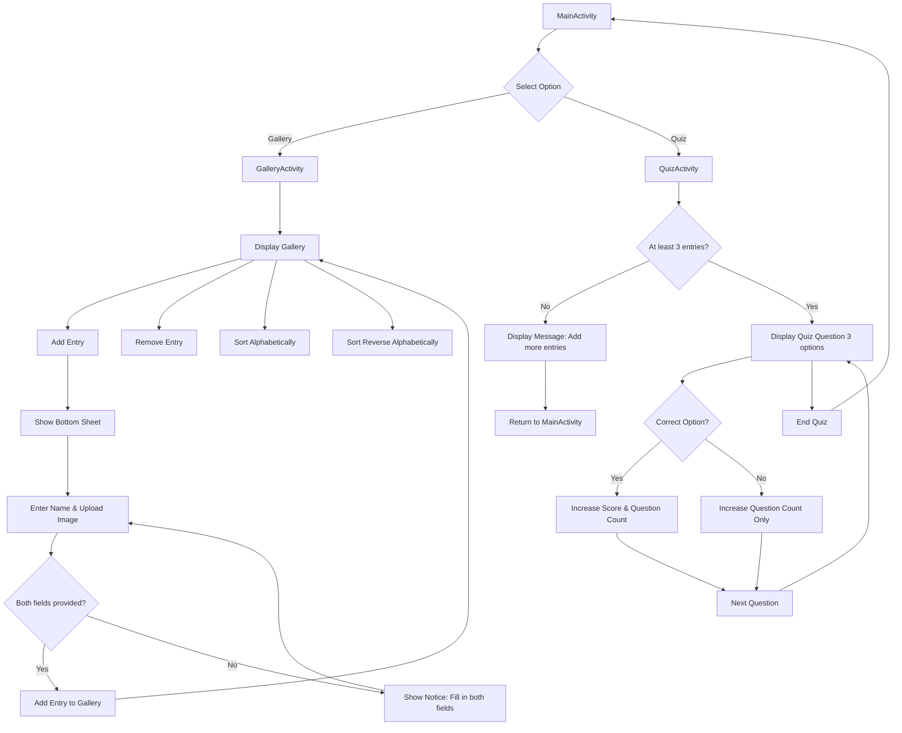

# QuizApp153
Welcome to to our android Quiz application! This project is developed as part of a mandatory task in DAT153 at HVL. The application is designed to showcase essential Android development concepts by integrating interactive quiz functionality with a dynamic gallery management system.

The app use XML to render the user interface and utilizes Java for handling the application logic.
## Key Features

- **MainActivity:**  
  Serves as the central hub where users can navigate between the Quiz and Gallery features.

- **QuizActivity:**  
  - Starts the quiz only if there are at least three entries available.  
  - Users can answer quiz questions, where the score increases for correct answers, and only the question count increases for incorrect responses.  
  - The quiz continues until the user decides to end it, at which point they are returned to the MainActivity.

- **GalleryActivity:**  
  - Allows users to manage a collection of entries.  
  - Users can add new entries via a bottom sheet, which prompts them to enter a name and upload an image.  
  - Provides options to remove entries and sort them alphabetically or in reverse order.  
  - Includes a back button to return to the MainActivity.
 ## Run Configurations for Android Studio

To run the **Quiz & Gallery Android Application** in Android Studio, follow these steps:

1. **Open the Project:**
   - Launch Android Studio and open the project.

2. **Edit Run Configurations:**
   - Go to **Run** > **Edit Configurations...**
   - Click the **+** button and select **Android App**.

3. **Configure the New Run Configuration:**
   - **Name:** `QuizApp`
   - **Module:** `app`
   - **Deploy:** Use the default APK deployment settings.
   - **Launch Options:** Select **Default Activity** (or specify `MainActivity` if needed).
   - Click **Apply** and then **OK**.

4. **Run the Application:**
   - Use the **Run** button in the toolbar or press **Shift + F10** to start the app.

## Application flowchart
We have providerd a flowchart showing the flows inside the application. This includes expected and unexpected flows with illustration of how errors from the user is handled


# QuizApp - Test Documentation

## Overview

This document provides an overview of the test cases implemented for the **QuizApp** project. Each test case includes:

- **Test Description:** What the test validates.
- **Expected Result:** The expected behavior.
- **Implementation:** The class and method responsible for the test.
- **Test Result:** Pass or fail status.
- **Failure Analysis & Fixes:** If a test fails, an explanation and proposed fixes.

---

## Test Cases

### **1. Navigation from Main Menu**

#### **Description**

This test ensures that clicking on the **Quiz** or **Gallery** button in the **Main Menu** opens the correct activity.

#### **Expected Result**

1. Clicking **Quiz** button opens **QuizActivity**.
2. Clicking **Gallery** button opens **GalleryActivity**.

#### **Implementation**

- **Class:** `MainActivityNavigationTest.java`
- **Methods:**
  - `testNavigationToQuizActivity()`
  - `testNavigationToGalleryActivity()`

#### **Test Result:** ✅ **PASSED**

---

### **2. Data Registration in Gallery**

#### **Description**

This test verifies that:

1. A user can add an entry to the gallery.
2. The entry appears in the **RecyclerView**.
3. The entry is removed correctly when deleted.

#### **Expected Result**

1. Initial count of gallery items is recorded.
2. A new entry is added with name **"Random green sweatshirt guy"** and a stubbed image.
3. The count increases by **1**.
4. The entry is deleted.
5. The count returns to the original value.

#### **Implementation**

- **Class:** `DataRegistrationTest.java`
- **Method:** `testAddAndDeleteEntry()`

#### **Test Result:** ✅ **PASSED**

---

### **3. Quiz Score Update**

#### **Description**

This test simulates a user answering quiz questions and verifies that:

1. The **score updates correctly** for correct answers.
2. Incorrect answers do **not** increment the score.

#### **Expected Result**

- Correct answer increases score.
- Wrong answer does **not** increase score.

#### **Implementation**

- **Class:** `QuizScoreTest.java`
- **Method:**
    - `testCorrectAnswerUpdatesScore()`
    - `testIncorrectAnswerDoesNotIncrementScore()`

#### **Test Result: ❌ FAILED**

- **Issue:** 

```shell
java.lang.NullPointerException: Attempt to invoke virtual method 'int java.util.ArrayList.size()' on a null object reference
at com.swampbeardev.quizapp.QuizFragment.onViewCreated(QuizFragment.java:54)
```

- **Fix:** Initialized `galleryItems` in `QuizApplication`

```java
private ArrayList<GalleryItem> galleryItems = new ArrayList<>();
```

- **Retested:** ✅ **PASSED**

---

## Conclusion

| **Test Case**                      | **Result**       |
| ---------------------------------- | ---------------- |
| **Navigation to Quiz/Gallery**     | ✅ Passed         |
| **Data Registration (Add/Delete)** | ✅ Passed         |
| **Quiz Score Updates**             | ✅ Fixed & Passed |
